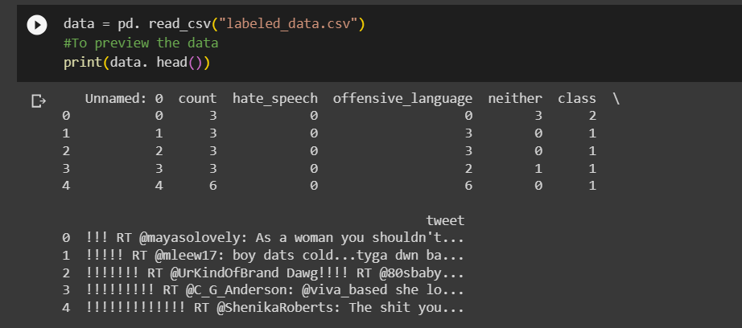
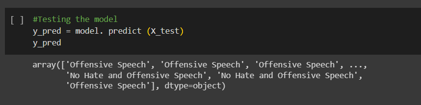
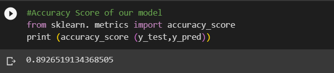
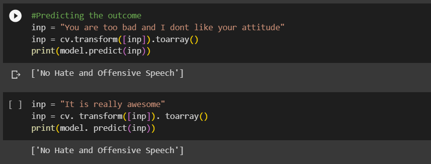

# Hate-Speech-and-Offensive-Language
## Introduction
    Hate speech detection is a crucial tool for identifying and combating the proliferation of offensive and harmful
    language on the internet.    In the realm of social media, where countless individuals freely express themselves,
    there exists an unfortunate prevalence of hateful comments and hurtful content targeted at others. Consequently,
    the development of effective hate speech detection systems has become an indispensable solution to address the 
    challenges posed by the digital landscape of today.With a clear understanding of the project's primary 
    objective, let's embark on the journey of constructing a Python-based hate speech detection project.

## Setting up the development environment

    The initial crucial step involves configuring your development environment to create a Hate Speech detection
    project using Python. To embarkvon the development of a Hate Speech detection project, it's essential to have
    a system equipped with the Jupyter notebook software. Alternatively,you can opt for Google Colab 
    (https://colab.research.google.com/) as your development platform.

## Understanding the data
    Understanding the dataset for model training is a crucial step in the machine learning pipeline. It involves
    comprehensively analyzing the dataset to gain insights into its structure, characteristics, and the 
    relationships between its components. This process typically includes tasks such as data
    exploration, statistical analysis, and visualization techniques to uncover patterns, trends, and potential
    challenges within the data. Furthermore,understanding the dataset helps in making informed decisions about 
    data preprocessing, feature engineering, and model selection, ultimately leading to the development of 
    effective machine learning models. In essence, a thorough understanding of the dataset forms the foundation 
    upon which successful model training and subsequent analysis are built.

        Identifier – This column contains unique index values for each entry.
        User Count – This field indicates the number of users who evaluated each tweet.
        Hate Speech Votes – The number of users who categorized the tweet as hate speech.
        Offensive Language Votes – The count of users who labeled the tweet as offensive.
        Neutral Votes – The number of users who considered the tweet neither offensive nor non-offensive.
        Label – This column provides a class label based on the majority of user judgments, with 0 signifying 
        hate speech,1 representing offensive language, and 2 indicating neither.
        Text Content – This column contains the actual text of the tweet.

## Program
### Importing the required libraries
~~~python
#Importing the packages
import pandas as pd
import numpy as np
from sklearn. feature_extraction. text import CountVectorizer
from sklearn. model_selection import train_test_split
from sklearn. tree import DecisionTreeClassifier
~~~
### Importing NLTK( The Natural Language Toolkit) library
~~~python
import nltk
import re
#nltk. download('stopwords')
from nltk. corpus import stopwords
stopword=set(stopwords.words('english'))
stemmer = nltk. SnowballStemmer("english")
~~~
### Load Dataset
~~~python
data = pd. read_csv("data.csv")
#To preview the data
print(data. head())
~~~
### Preprocessing the data
~~~python
data["labels"] = data["class"]. map({0: "Hate Speech", 1: "Offensive Speech", 2: "No Hate and Offensive Speech"})
data = data[["tweet", "labels"]]
print(data. head())
~~~
### Cleaning the data set
~~~python
def clean (text):
 text = str (text). lower()
 text = re. sub('[.?]', '', text) 
 text = re. sub('https?://\S+|www.\S+', '', text)
 text = re. sub('<.?>+', '', text)
 text = re. sub('[%s]' % re. escape(string. punctuation), '', text)
 text = re. sub('\n', '', text)
 text = re. sub('\w\d\w', '', text)
 text = [word for word in text.split(' ') if word not in stopword]
 text=" ". join(text)
 text = [stemmer. stem(word) for word in text. split(' ')]
 text=" ". join(text)
 return text
data["tweet"] = data["tweet"]. apply(clean)
~~~
### Splitting the data
~~~python
x = np. array(data["tweet"])
y = np. array(data["labels"])
cv = CountVectorizer()
X = cv. fit_transform(x)
# Splitting the Data
X_train, X_test, y_train, y_test = train_test_split(X, y, test_size=0.33, random_state=42)
~~~
### Building the model
~~~python
#Model building
model = DecisionTreeClassifier()
#Training the model
model. fit(X_train,y_train)
~~~
### Evaluating the results
~~~python
#Testing the model
y_pred = model. predict (X_test)
y_pred
~~~
### Predicting the outcome
~~~python
inp = "You are too bad and I dont like your attitude"
inp = cv.transform([inp]).toarray()
print(model.predict(inp))
~~~

## Output
### Preview dataset

https://github.com/kiran03-jagadeesh/Hate-Speech-and-Offensive-Language/blob/main/previewdataset1.png

### Testing model

### Accuracy

### Outcome prediction

